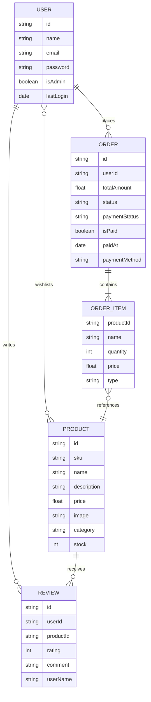

JusVend Backend Structure and API Details

The backend is structured as a RESTful API using Express.js, providing a robust foundation for handling e-commerce operations. It is responsible for handling authentication, product management, order execution, admin dashboard statistics, and wishlist management.

Backend Security and Design Features
JWT-based authentication for protected routes.
Password encryption using bcryptjs.
RESTful API design for modularity and scalability.
Role-based access control (User vs. Admin) for secure operations.
MongoDB schemas for structured and flexible data storage.
Modular routing to ensure maintainability of the codebase.

6.1 API Endpoints

Authentication Module (/api/auth)
The Authentication module manages user registration and login functionality. Secure password handling and token-based authentication ensure safe access to protected resources.

POST /api/auth/register
Creates a new user account by storing user credentials in the database after encrypting the password.
POST /api/auth/login
Authenticates the user and returns a JSON Web Token (JWT) used for accessing protected APIs.

FIGURE: USER SCHEMA
The User schema stores details such as name, email (unique), hashed password, admin status, and the user's wishlist items.

Products Module (/api/products)
This module provides product information and allows users to interact with the inventory through reviews.

GET /api/products
Retrieves a list of all products with optional filtering by keyword, category, and price range.
GET /api/products/:id
Fetches detailed information for a specific product, including associated user reviews.
POST /api/products/:id/reviews (Protected)
Allows authenticated users to submit a rating and comment for a product.

Orders Module (/api/orders)
The Orders module handles the checkout process and order history.

POST /api/orders (Protected)
Places a new order. This endpoint validates stock levels, deducts inventory, and stores transaction details.
PUT /api/orders/:id/pay (Protected)
Marks a specific order as paid and updates its status to 'Completed'.
GET /api/orders (Protected)
Retrieves the complete order history for the logged-in user.

Admin Module (/api/admin)
The Admin module provides exclusive endpoints for managing the platform.

GET /api/admin/stats (Admin Only)
Provides a summary of total products, orders, users, and total sales revenue.
GET /api/admin/products (Admin Only)
Retrieves all products for management purposes.
POST/PUT/DELETE /api/admin/products (Admin Only)
Full CRUD operations for managing the product inventory.
GET /api/admin/orders (Admin Only)
Retrieves all orders placed on the platform for administrative review.
GET /api/admin/activity (Admin Only)
Fetches recent system activity, such as new orders and stock updates.

User & Wishlist Module (/api/users)
Manages user-specific data like preferences and saved items.

GET /api/users/wishlist (Protected)
Retrieves the list of products saved to the user's wishlist.
PUT /api/users/wishlist/:productId (Protected)
Toggles (adds/removes) a product from the user's wishlist.

Print/Upload Module (/api/print)
Handles file uploads for services that require printing (e.g., printing documents or photos).

POST /api/print
Handles multi-format file uploads (PDF, Images, etc.) and stores them in a secure upload directory.

6.2 Entity Relationship (ER) Diagram

The following diagram illustrates the relationships between the core entities in the JusVend system.

Database Models
The project utilizes several MongoDB models to manage data:
Product Model: Stores product details including name, price, stock, and category.
Order Model: Manages transaction data, item lists, and payment status.
Review Model: Stores user feedback and ratings for specific products.
User Model: Stores account information and security credentials.

